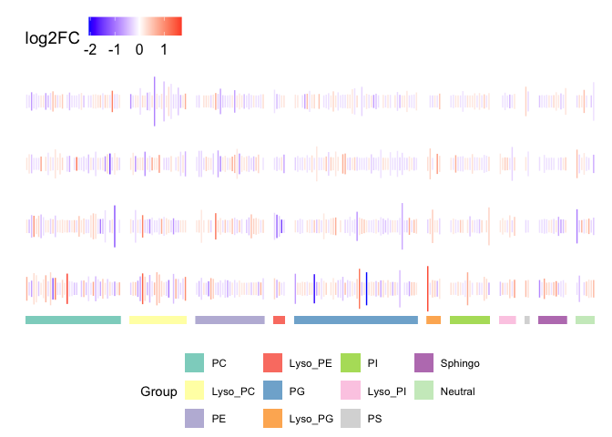
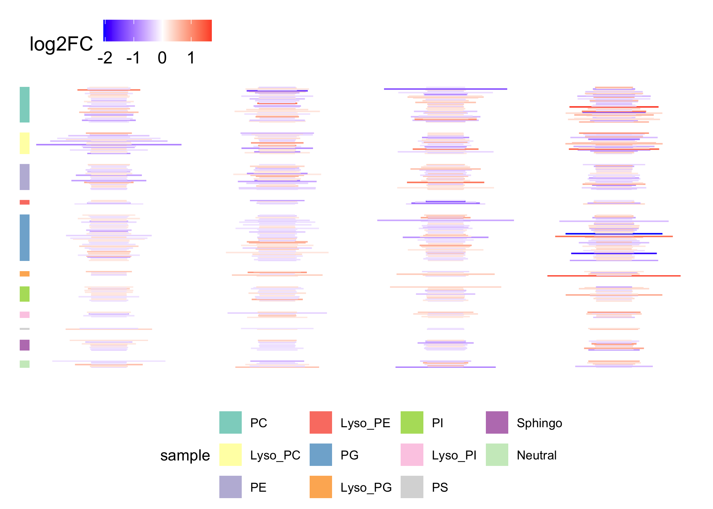
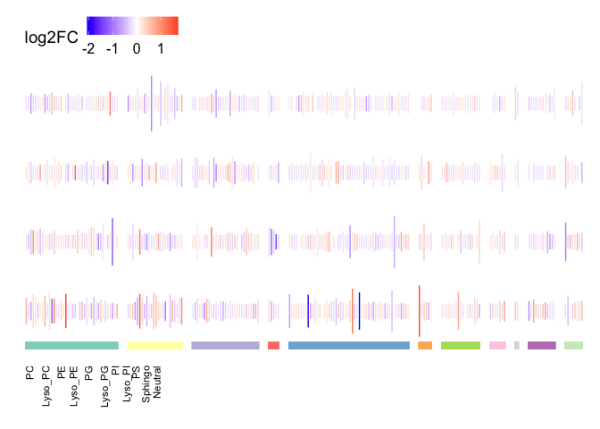
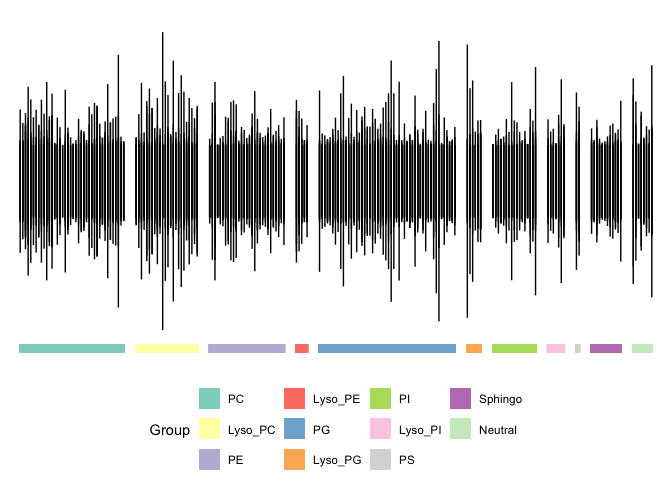
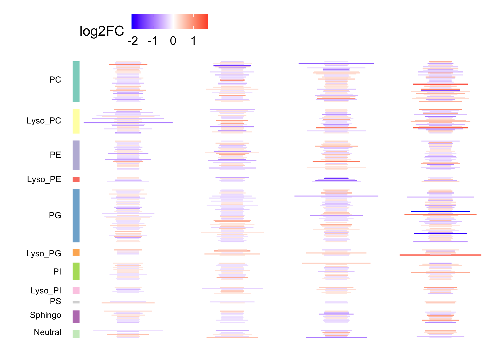
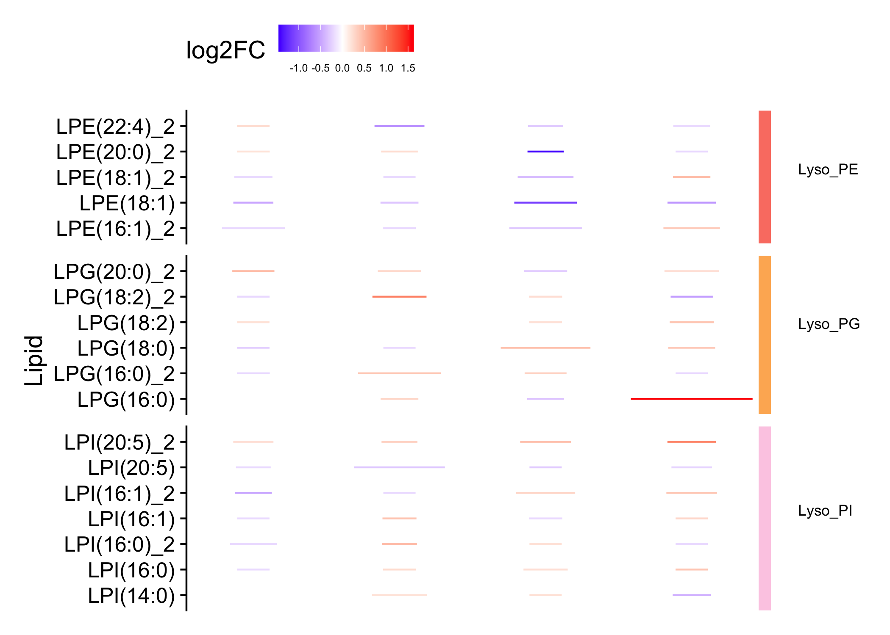
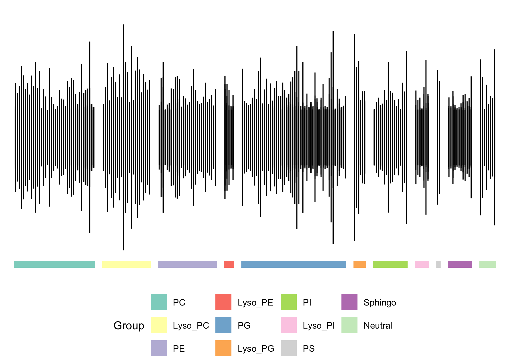

# matrixBP


``` r
library(matrixBP)
```

    Loading required package: deeptime

    Loading required package: ggplot2

    Loading required package: patchwork

``` r
library(dplyr)
```


    Attaching package: 'dplyr'

    The following objects are masked from 'package:stats':

        filter, lag

    The following objects are masked from 'package:base':

        intersect, setdiff, setequal, union

``` r
library(RColorBrewer)
library(cowplot)
```


    Attaching package: 'cowplot'

    The following object is masked from 'package:patchwork':

        align_plots

``` r
theme_set(theme_cowplot())


# need to install the package before this script will work.
if(FALSE)
{
  # After cloning the repo, create a new R Project (File -> New Project... -> Existing Directory) and run the following command in the console:
  # Download https://nih-my.sharepoint.com/:u:/g/personal/johnsonra_nih_gov/EeEo-VNRXchMl47X2jhcHLcB2IaSH--TKOcUpS5OLvBoSQ?e=lQwu9Q and save it to `data/metlip.rda`
  devtools::install()
}


# Load the data
data(metlip)

# colors for facet_grid labels
grp_colors <- levels(metlip$Group) |>
  length() |>
  brewer.pal('Set3')
names(grp_colors) <- levels(metlip$Group)


# plot with colored facets
matrix_barplot(metlip, aes(x = Lipid, y = neg_log_p, color = log2FC),
               cols = vars(Group), rows = vars(sample), facet_colors = grp_colors) |>
  mBP_legend()
```

    Warning: Removed 11 rows containing missing values or values outside the scale range
    (`geom_rect()`).



``` r
# plot in portrait orientation
matrix_barplot(metlip, aes(x = neg_log_p, y = Lipid, color = log2FC),
               cols = vars(sample), rows = vars(Group), facet_colors = grp_colors,
               orientation = 'portrait') |>
  mBP_legend()
```

    Warning: Removed 11 rows containing missing values or values outside the scale range
    (`geom_rect()`).



``` r
# change the color of the bars
g1 <- matrix_barplot(metlip, aes(x = Lipid, y = neg_log_p, color = log2FC),
               cols = vars(Group), rows = vars(sample), facet_colors = grp_colors) +
  scale_color_gradient2(low = 'purple3', high = 'orange3')
```

    Scale for colour is already present.
    Adding another scale for colour, which will replace the existing scale.

``` r
mBP_legend(g1)
```

    Warning: Removed 11 rows containing missing values or values outside the scale range
    (`geom_rect()`).



``` r
# plots with labeled facets
matrix_barplot(metlip, aes(x = Lipid, y = neg_log_p, color = log2FC),
               cols = vars(Acyl_1), rows = vars(sample)) |>
  mBP_col_labels()
```



``` r
matrix_barplot(metlip, aes(x = neg_log_p, y = Lipid, color = log2FC),
               cols = vars(sample), rows = vars(Group), facet_colors = grp_colors,
               orientation = 'portrait') |>
  mBP_row_labels()
```



``` r
# plot with 12 samples
(g <- metlip |>
  bind_rows(mutate(metlip, sample = paste0(sample, 1)),
            mutate(metlip, sample = paste0(sample, 2))) |>
  
  matrix_barplot(aes(x = Lipid, y = neg_log_p, color = log2FC),
                 cols = vars(Group), rows = vars(sample), facet_colors = grp_colors) |>
  mBP_legend())
```

    Warning: Removed 11 rows containing missing values or values outside the scale range
    (`geom_rect()`).



``` r
# larger plots seem to have trouble rendering in RStudio, but saving them as a file works
#ggsave('12_samples.png', g, width = 10, height = 10)

# trying to plot multiple samples on a single row causes the colors not to work
# add a catch that will notify the user if they try to do this
matrix_barplot(metlip, aes(x = Lipid, y = neg_log_p, color = log2FC),
               cols = vars(Group), facet_colors = grp_colors) |>
  mBP_legend()
```

    Warning: The following aesthetics were dropped during statistical transformation:
    colour.
    ℹ This can happen when ggplot fails to infer the correct grouping structure in
      the data.
    ℹ Did you forget to specify a `group` aesthetic or to convert a numerical
      variable into a factor?

    Warning: The following aesthetics were dropped during statistical transformation:
    colour.
    ℹ This can happen when ggplot fails to infer the correct grouping structure in
      the data.
    ℹ Did you forget to specify a `group` aesthetic or to convert a numerical
      variable into a factor?
    The following aesthetics were dropped during statistical transformation:
    colour.
    ℹ This can happen when ggplot fails to infer the correct grouping structure in
      the data.
    ℹ Did you forget to specify a `group` aesthetic or to convert a numerical
      variable into a factor?
    The following aesthetics were dropped during statistical transformation:
    colour.
    ℹ This can happen when ggplot fails to infer the correct grouping structure in
      the data.
    ℹ Did you forget to specify a `group` aesthetic or to convert a numerical
      variable into a factor?
    The following aesthetics were dropped during statistical transformation:
    colour.
    ℹ This can happen when ggplot fails to infer the correct grouping structure in
      the data.
    ℹ Did you forget to specify a `group` aesthetic or to convert a numerical
      variable into a factor?
    The following aesthetics were dropped during statistical transformation:
    colour.
    ℹ This can happen when ggplot fails to infer the correct grouping structure in
      the data.
    ℹ Did you forget to specify a `group` aesthetic or to convert a numerical
      variable into a factor?
    The following aesthetics were dropped during statistical transformation:
    colour.
    ℹ This can happen when ggplot fails to infer the correct grouping structure in
      the data.
    ℹ Did you forget to specify a `group` aesthetic or to convert a numerical
      variable into a factor?
    The following aesthetics were dropped during statistical transformation:
    colour.
    ℹ This can happen when ggplot fails to infer the correct grouping structure in
      the data.
    ℹ Did you forget to specify a `group` aesthetic or to convert a numerical
      variable into a factor?
    The following aesthetics were dropped during statistical transformation:
    colour.
    ℹ This can happen when ggplot fails to infer the correct grouping structure in
      the data.
    ℹ Did you forget to specify a `group` aesthetic or to convert a numerical
      variable into a factor?
    The following aesthetics were dropped during statistical transformation:
    colour.
    ℹ This can happen when ggplot fails to infer the correct grouping structure in
      the data.
    ℹ Did you forget to specify a `group` aesthetic or to convert a numerical
      variable into a factor?
    The following aesthetics were dropped during statistical transformation:
    colour.
    ℹ This can happen when ggplot fails to infer the correct grouping structure in
      the data.
    ℹ Did you forget to specify a `group` aesthetic or to convert a numerical
      variable into a factor?
    The following aesthetics were dropped during statistical transformation:
    colour.
    ℹ This can happen when ggplot fails to infer the correct grouping structure in
      the data.
    ℹ Did you forget to specify a `group` aesthetic or to convert a numerical
      variable into a factor?
    The following aesthetics were dropped during statistical transformation:
    colour.
    ℹ This can happen when ggplot fails to infer the correct grouping structure in
      the data.
    ℹ Did you forget to specify a `group` aesthetic or to convert a numerical
      variable into a factor?
    The following aesthetics were dropped during statistical transformation:
    colour.
    ℹ This can happen when ggplot fails to infer the correct grouping structure in
      the data.
    ℹ Did you forget to specify a `group` aesthetic or to convert a numerical
      variable into a factor?
    The following aesthetics were dropped during statistical transformation:
    colour.
    ℹ This can happen when ggplot fails to infer the correct grouping structure in
      the data.
    ℹ Did you forget to specify a `group` aesthetic or to convert a numerical
      variable into a factor?
    The following aesthetics were dropped during statistical transformation:
    colour.
    ℹ This can happen when ggplot fails to infer the correct grouping structure in
      the data.
    ℹ Did you forget to specify a `group` aesthetic or to convert a numerical
      variable into a factor?
    The following aesthetics were dropped during statistical transformation:
    colour.
    ℹ This can happen when ggplot fails to infer the correct grouping structure in
      the data.
    ℹ Did you forget to specify a `group` aesthetic or to convert a numerical
      variable into a factor?
    The following aesthetics were dropped during statistical transformation:
    colour.
    ℹ This can happen when ggplot fails to infer the correct grouping structure in
      the data.
    ℹ Did you forget to specify a `group` aesthetic or to convert a numerical
      variable into a factor?
    The following aesthetics were dropped during statistical transformation:
    colour.
    ℹ This can happen when ggplot fails to infer the correct grouping structure in
      the data.
    ℹ Did you forget to specify a `group` aesthetic or to convert a numerical
      variable into a factor?
    The following aesthetics were dropped during statistical transformation:
    colour.
    ℹ This can happen when ggplot fails to infer the correct grouping structure in
      the data.
    ℹ Did you forget to specify a `group` aesthetic or to convert a numerical
      variable into a factor?
    The following aesthetics were dropped during statistical transformation:
    colour.
    ℹ This can happen when ggplot fails to infer the correct grouping structure in
      the data.
    ℹ Did you forget to specify a `group` aesthetic or to convert a numerical
      variable into a factor?
    The following aesthetics were dropped during statistical transformation:
    colour.
    ℹ This can happen when ggplot fails to infer the correct grouping structure in
      the data.
    ℹ Did you forget to specify a `group` aesthetic or to convert a numerical
      variable into a factor?
    The following aesthetics were dropped during statistical transformation:
    colour.
    ℹ This can happen when ggplot fails to infer the correct grouping structure in
      the data.
    ℹ Did you forget to specify a `group` aesthetic or to convert a numerical
      variable into a factor?
    The following aesthetics were dropped during statistical transformation:
    colour.
    ℹ This can happen when ggplot fails to infer the correct grouping structure in
      the data.
    ℹ Did you forget to specify a `group` aesthetic or to convert a numerical
      variable into a factor?
    The following aesthetics were dropped during statistical transformation:
    colour.
    ℹ This can happen when ggplot fails to infer the correct grouping structure in
      the data.
    ℹ Did you forget to specify a `group` aesthetic or to convert a numerical
      variable into a factor?
    The following aesthetics were dropped during statistical transformation:
    colour.
    ℹ This can happen when ggplot fails to infer the correct grouping structure in
      the data.
    ℹ Did you forget to specify a `group` aesthetic or to convert a numerical
      variable into a factor?
    The following aesthetics were dropped during statistical transformation:
    colour.
    ℹ This can happen when ggplot fails to infer the correct grouping structure in
      the data.
    ℹ Did you forget to specify a `group` aesthetic or to convert a numerical
      variable into a factor?
    The following aesthetics were dropped during statistical transformation:
    colour.
    ℹ This can happen when ggplot fails to infer the correct grouping structure in
      the data.
    ℹ Did you forget to specify a `group` aesthetic or to convert a numerical
      variable into a factor?
    The following aesthetics were dropped during statistical transformation:
    colour.
    ℹ This can happen when ggplot fails to infer the correct grouping structure in
      the data.
    ℹ Did you forget to specify a `group` aesthetic or to convert a numerical
      variable into a factor?
    The following aesthetics were dropped during statistical transformation:
    colour.
    ℹ This can happen when ggplot fails to infer the correct grouping structure in
      the data.
    ℹ Did you forget to specify a `group` aesthetic or to convert a numerical
      variable into a factor?
    The following aesthetics were dropped during statistical transformation:
    colour.
    ℹ This can happen when ggplot fails to infer the correct grouping structure in
      the data.
    ℹ Did you forget to specify a `group` aesthetic or to convert a numerical
      variable into a factor?
    The following aesthetics were dropped during statistical transformation:
    colour.
    ℹ This can happen when ggplot fails to infer the correct grouping structure in
      the data.
    ℹ Did you forget to specify a `group` aesthetic or to convert a numerical
      variable into a factor?
    The following aesthetics were dropped during statistical transformation:
    colour.
    ℹ This can happen when ggplot fails to infer the correct grouping structure in
      the data.
    ℹ Did you forget to specify a `group` aesthetic or to convert a numerical
      variable into a factor?

    Warning: Removed 11 rows containing missing values or values outside the scale range
    (`geom_rect()`).



``` r
# try adding `na.rm = TRUE` to `scale_...` to see if that gets rid of warnings about NA values
```
