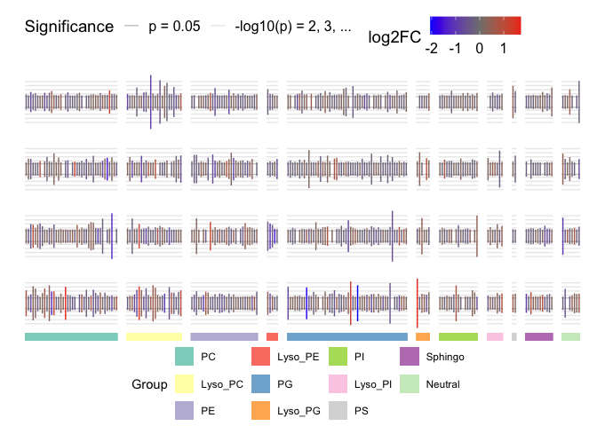
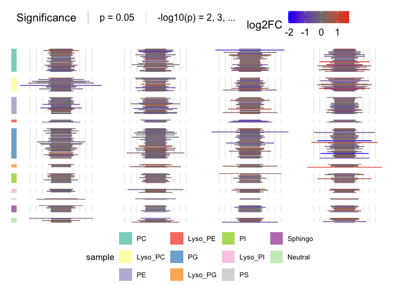
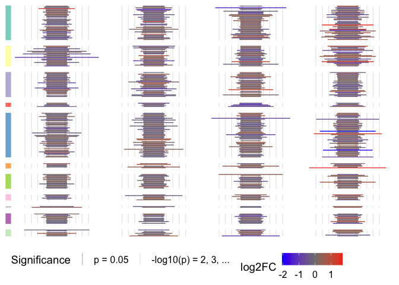
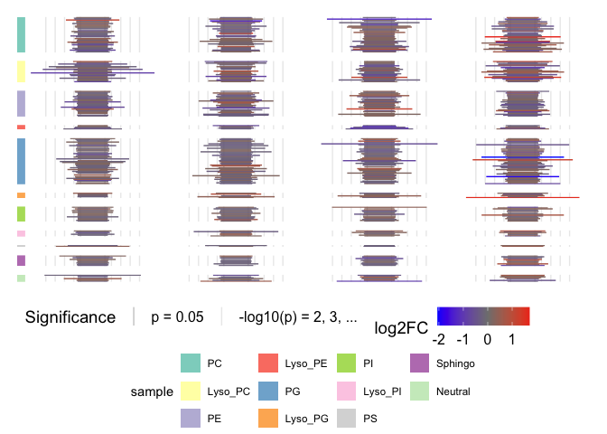
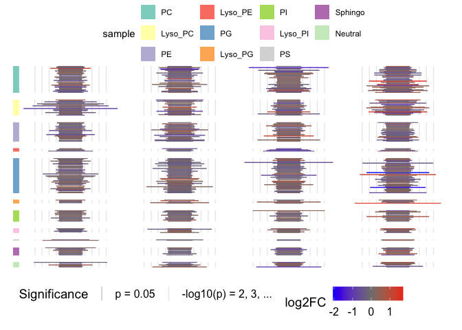
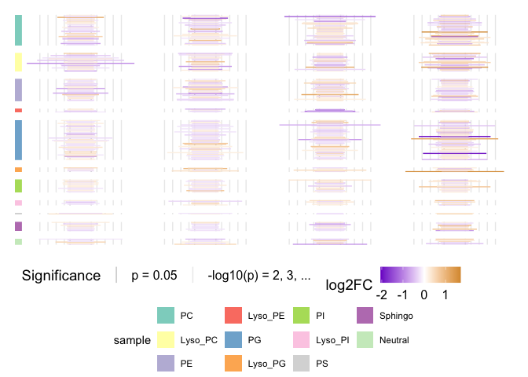
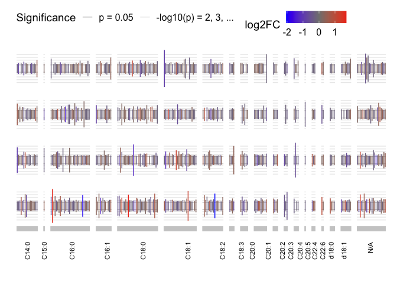
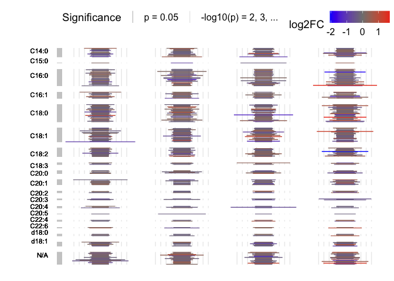
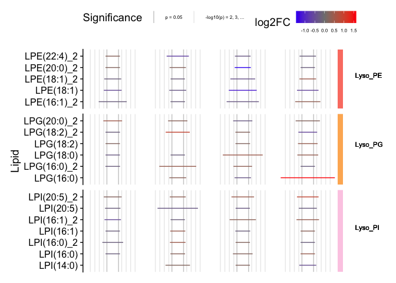
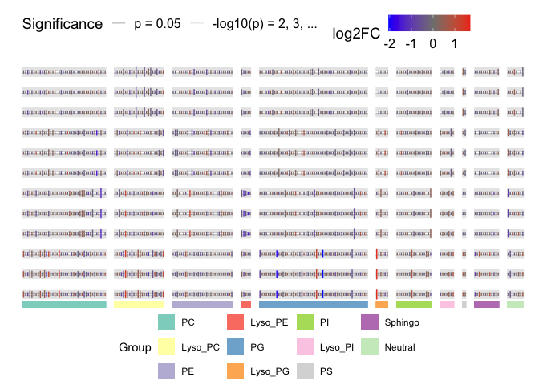

# matrixBP


[](https://doi.org/10.5281/zenodo.14749077)

## Installation

To install the matrixBP package, you can use the following command in R:

    devtools::install_github('IDSS-NIAID/matrixBP')

## Examples

### Setup

I addition to the `matrixBP` package, we will be using `dplyr`,
`RColorBrewer`, and `cowplot` for these examples.

``` r
library(matrixBP)
library(dplyr)
library(RColorBrewer)
library(cowplot)
theme_set(theme_cowplot())
```

`matrixBP` comes with a simulated data set for running examples, and
we’ll use ColorBrewer’s Set3 for the group colors used in the
`facet_grid`.

``` r
# Load the data
data(metlip)

# view structure of `metlip`
metlip
```

    # A tibble: 768 × 7
       Lipid         Group Acyl_1 Acyl_2 sample log2FC neg_log_p
       <chr>         <fct> <chr>  <chr>  <chr>   <dbl>     <dbl>
     1 PC(14:0_14:0) PC    C14:0  C14:0  A      -0.205      1.83
     2 PC(14:0_16:0) PC    C14:0  C16:0  A      -0.237      1.66
     3 PC(14:0_18:0) PC    C14:0  C18:0  A      -0.712      2.45
     4 PC(16:1_18:0) PC    C16:1  C18:0  A      -0.239      2.26
     5 PC(18:0_18:0) PC    C18:0  C18:0  A       0.434      1.73
     6 PC(14:0_18:1) PC    C14:0  C18:1  A      -0.241      1.92
     7 PC(16:1_18:1) PC    C16:1  C18:1  A       0.543      2.70
     8 PC(18:0_18:1) PC    C18:0  C18:1  A      -0.264      1.69
     9 PC(18:1_18:1) PC    C18:1  C18:1  A      -0.208      1.60
    10 PC(16:0_18:2) PC    C16:0  C18:2  A      -0.240      2.17
    # ℹ 758 more rows

``` r
# colors for facet_grid labels
grp_colors <- levels(metlip$Group) |>
  length() |>
  brewer.pal('Set3')
names(grp_colors) <- levels(metlip$Group)
```

### Matrix bar plots with colored facets

For our first example we will display the toy data in `metlip` with
columns grouped by `Group` and one row per `sample`.

``` r
# plot with colored facets
matrix_barplot(metlip, aes(x = Lipid, y = neg_log_p, color = log2FC),
               cols = vars(Group), rows = vars(sample), facet_colors = grp_colors) |>
  mBP_legend()
```



The same figure in portrait orientation can be viewed with:

``` r
# plot in portrait orientation
matrix_barplot(metlip, aes(x = neg_log_p, y = Lipid, color = log2FC),
               cols = vars(sample), rows = vars(Group), facet_colors = grp_colors,
               orientation = 'portrait') |>
  mBP_legend()
```



We can also change the location of the legends. `matrix_barplot` returns
a `ggplot2` object, which can be modified with the usual `ggplot2`
commands.

``` r
g1 <- matrix_barplot(metlip, aes(x = neg_log_p, y = Lipid, color = log2FC),
                     cols = vars(sample), rows = vars(Group), facet_colors = grp_colors,
                     orientation = 'portrait') +
  theme(legend.position = 'bottom')
```



The addition of a legend for the facets uses `mBP_legend`, which takes
the `ggplot2` object, `g`, that we saved above.

``` r
mBP_legend(g1)
```



This also takes a `legend.position` argument. For example:

``` r
mBP_legend(g1, legend.position = 'top')
```



Other modifcations can be made to `g` and should be layered on before
passing the object to `mBP_legend`. So, for exmaple, we could change the
colors for the log2 fold change as follows:

``` r
# change the color of the bars
(g1 + scale_color_gradient2(low = 'purple3', high = 'orange3')) |>
  mBP_legend()
```

    Scale for colour is already present.
    Adding another scale for colour, which will replace the existing scale.



> [!TIP]
>
> You may get an error when trying to run the previous command:
>
>     Error in UseMethod("ggplot_build") :
>       no applicable method for 'ggplot_build' applied to an object of class "c('ScaleContinuous', 'Scale', 'ggproto', 'gg')"
>
> This is because you need extra perentheses. Without the extra
> parentheses:
>
>     g1 + scale_color_gradient2(low = 'purple3', high = 'orange3') |>
>       mBP_legend()
>
> R follows a specific order of precidence and tries to pass
> `scale_color_gradien2` to `mBP_legend` *before* adding it to `g`.
> Adding the extra parentheses will execute properly:
>
>     (g1 + scale_color_gradient2(low = 'purple3', high = 'orange3')) |>
>       mBP_legend()
>
> Alternately, you can save the results from the first line and call
> `mBP_legend` directly as follows:
>
>     g2 <- g1 + scale_color_gradient2(low = 'purple3', high = 'orange3')
>     mBP_legend(g2)

### Matrix bar plots with many facets

When we have too many groups that we want to summarize, we end up with
more facets than differentiable colors. In this case, we can annotate
the figure with labels instead of colors using `mBP_col_labels` or
`mBP_row_labels`, depending on the orientation.

``` r
# plots with labeled facets
matrix_barplot(metlip, aes(x = Lipid, y = neg_log_p, color = log2FC),
               cols = vars(Acyl_1), rows = vars(sample)) |>
  mBP_col_labels()
```



``` r
matrix_barplot(metlip, aes(x = neg_log_p, y = Lipid, color = log2FC),
               cols = vars(sample), rows = vars(Acyl_1),
               orientation = 'portrait') |>
  mBP_row_labels()
```



Sometimes it is also desirable to include labels for each value in the
data set, rather than labeling them by group. This can result in many
lines of text but is possible with a sufficiently large figure or when
subsetting to a few groups as below.

``` r
(filter(metlip, Group %in% c('Lyso_PE', 'Lyso_PG', 'Lyso_PI')) |>
  matrix_barplot(aes(x = neg_log_p, y = Lipid, color = log2FC),
               cols = vars(sample), rows = vars(Group), facet_colors = grp_colors,
               orientation = 'portrait', 
               switch = TRUE, remove.y.labels = FALSE) +
      theme(legend.text = element_text(size = 6))) |>
  mBP_row_labels()
```



> [!TIP]
>
> Using `switch = TRUE` will move the facet labels to the right to allow
> better placement of the row labels.

### Common issues

#### Trying to plot too many samples

As with the issue of adding many labels, including too many samples will
result in difficulty with visualization of the entire data set. In the
example below, making the size of the figure much larger or looking at a
subset of samples can be good options.

``` r
# plot with 12 samples
g3 <- metlip |>
  bind_rows(mutate(metlip, sample = paste0(sample, 1)),
            mutate(metlip, sample = paste0(sample, 2))) |>
  
  matrix_barplot(aes(x = Lipid, y = neg_log_p, color = log2FC),
                 cols = vars(Group), rows = vars(sample), facet_colors = grp_colors) |>
  mBP_legend()
```



#### Rendering of larger plots

Sometimes RStudio will have difficulty rendering larger plots in the
interactive plots pane. Users may find it helpful to save these directly
to a file and open them in a different application for review. For
example, if the figure above does not render gracefully in the
interactive preview within RStudio, try saving with the following:

``` r
# larger plots seem to have trouble rendering in RStudio, but saving them as a file works
ggsave(g3, '12_samples.png', g, width = 10, height = 10)
```

#### Error: multiple rows or columns plotted to the same position

Another common error users may encounter is when neglecting to include a
`rows` parameter when they should. In the example below no `rows`
parameter is provided even though `metlip` has multiple samples. This
results in an error:

``` r
# if you get this error, that is the likely cause of the issue.
matrix_barplot(metlip, aes(x = Lipid, y = neg_log_p, color = log2FC),
               cols = vars(Group), facet_colors = grp_colors) |>
  mBP_legend()
```

    Error in matrix_barplot(metlip, aes(x = Lipid, y = neg_log_p, color = log2FC),  : 
       multiple rows or columns plotted to the same position. Did you forget to define `rows` or `cols`?

Adding `rows = vars(sample)` in the call to `matrix_barplot` will
resolve this error.
